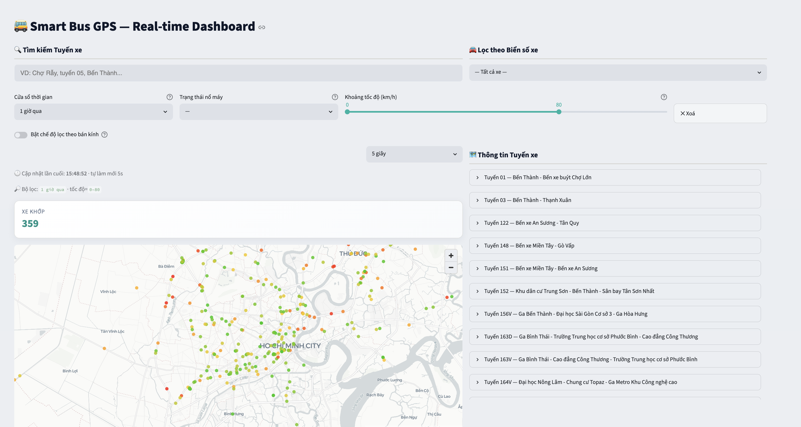

# Smart Bus GPS Search

A real-time GPS data streaming simulation for Ho Chi Minh City buses, built on a full end-to-end pipeline:

```
Data (JSON) → Simulator → Kafka → Logstash → Elasticsearch → FastAPI → Streamlit UI
```

The source data is historical GPS records (~104 million entries), replayed as a real-time stream and visualized on an interactive Streamlit map.

## Architecture


```
┌───────────┐    ┌─────────┐    ┌──────────┐    ┌───────────────┐
│ Simulator │───▶│  Kafka  │───▶│ Logstash │───▶│ Elasticsearch │
│(Producer) │    │(Broker) │    │  (ETL)   │    │  (Storage)    │
└───────────┘    └─────────┘    └──────────┘    └───────┬───────┘
  Reads JSON,      Buffer         Parses JSON,           │
  enriches data    topic:         geo_point,             └──────▶ FastAPI :8000
  with route info  bus-gps-raw   @timestamp                       /api/livebus
  shifts timestamps               → ES index                      /api/fuzzysearch
  → publishes                                                           │
    to Kafka                                                            ▼
                                                                 Streamlit :8501
                                                                 Live map + Route search
```

## Requirements

- **Docker Desktop** ≥ 4.x (allocate at least **6 GB RAM** in Docker Desktop Settings → Resources)

---

## Setup

### Step 0 — Clone the repo & prepare data

```bash
git clone <repo-url>
cd smart-bus-search
```

Place the GPS JSON data files in the following directory structure:

```
data/raw/
├── data/                          ← place sub_raw_*.json files here
│   ├── sub_raw_1.json
│   └── ...
├── vehicle_route_mapping.json     ← included in the repository
└── routes_clean.json              ← included in the repository
```

If you have the `hcmut-gps.zip` archive:

```bash
mkdir -p data/raw/data
unzip -o hcmut-gps.zip "part1/*" "part2/*" -d data/raw
mv data/raw/part1/part1/*.json data/raw/data/ 2>/dev/null
mv data/raw/part2/part2/*.json data/raw/data/ 2>/dev/null
rm -rf data/raw/part1 data/raw/part2
```

### Step 1 — Start the full stack

```bash
docker compose --profile simulate up -d --build
```

Docker starts services in the correct dependency order:

1. Elasticsearch & Kafka start and wait until `healthy`
2. **`init-index`** runs `create_index.py` — creates the `bus_waypoints` index with the correct mapping (`geo_point`, `keyword`, etc.)
3. Logstash starts only after the index is ready — prevents dynamic mapping conflicts
4. Backend, UI, and Simulator start in parallel

Wait **1–2 minutes** for all services to become ready.

### Step 2 — Access the services

| URL | Description |
|-----|-------------|
| http://localhost:8501 | Streamlit — Live map + Route search |
| http://localhost:8000/docs | FastAPI — Swagger UI |



---

## Verifying the pipeline

```bash
# Check if Elasticsearch has data
curl -s http://localhost:9200/bus_waypoints/_count

# Check if the backend API is up
curl -s http://localhost:8000/health

# Check if the Simulator is producing data
docker logs -f smart-bus-simulator

# Check if Logstash is consuming and indexing data
docker logs -f smart-bus-logstash
```

---

## Simulator configuration

The Simulator reads its config from the `.env` file in the project root:

| Variable | Default | Description |
|----------|---------|-------------|
| `BATCH_SIZE` | `50` | Number of records sent to Kafka per batch |
| `DELAY_MS` | `200` | Delay between batches (ms) |
| `SPEED_MULTIPLIER` | `1.0` | Playback speed multiplier (2.0 = twice as fast) |
| `LOOP` | `false` | Restart from the beginning when all data is exhausted |
| `MAX_FILES` | `0` | Limit the number of JSON files processed (0 = all) |

Pause / Resume the data stream:

```bash
docker kill --signal=SIGUSR1 smart-bus-simulator
```

---

## Starting & stopping

### Stop (preserve Elasticsearch data)

```bash
docker compose --profile simulate down
```

The next `docker compose up` will start immediately without re-initialization.

### Full reset (wipe Elasticsearch data)

```bash
# 1. Remove all containers and volumes
docker compose --profile simulate down -v

# 2. Restart (init-index will recreate the index with the correct mapping)
docker compose --profile simulate up -d --build
```

---

## Development — hot reload without restarting Docker

- **Backend** (`backend/`): uvicorn runs with `--reload`, automatically reloads on file save.
- **UI** (`ui/`): Streamlit runs with `--server.runOnSave true`, automatically refreshes the page.
- Only rebuild with `--build` when adding new packages to `requirements.txt`.

---

## Project structure

```
├── backend/                          ← FastAPI REST API
│   ├── Dockerfile
│   └── app/
│       ├── main.py                   ← Entry point, CORS, health check
│       ├── core/es_client.py         ← Elasticsearch client (singleton)
│       └── routers/
│           ├── livebus.py            ← GET /api/livebus (GeoJSON bus positions)
│           └── fuzzysearch.py        ← GET /api/fuzzysearch (route search)
│
├── ui/
│   ├── Dockerfile
│   └── smartsearchbus_web.py         ← Streamlit frontend
│
├── simulator/
│   ├── Dockerfile
│   ├── requirements.txt
│   └── simulate_gps.py               ← Kafka producer
│
├── logstash/
│   ├── config/logstash.yml
│   └── pipeline/kafka-to-es.conf     ← ETL: Kafka → transform → Elasticsearch
│
├── scripts/
│   └── create_index.py               ← Creates ES index with geo_point mapping (runs automatically via Docker)
│
├── data/
│   └── raw/
│       ├── data/                     ← sub_raw_*.json source files
│       ├── vehicle_route_mapping.json
│       ├── routes_clean.json
│       └── sample_small.json         ← 10 bản ghi mẫu thể hiện format raw GPS (đa dạng field)
│
├── docs/
│   ├── sample_es_doc.json            ← Ví dụ 5 document thực tế trong Elasticsearch (sau pipeline)
│   └── es_mapping.json               ← Mapping Elasticsearch của index bus_waypoints
│
├── .env                              ← Simulator configuration
├── requirements.txt                  ← Dependencies for backend, UI, and scripts
└── docker-compose.yml
```

## Demo notes

- Timestamps are shifted to "now" so the Streamlit map renders historical data as if it were live.
- Increase `SPEED_MULTIPLIER` or decrease `DELAY_MS` in `.env` to replay data faster.
- The map tile layer uses OpenStreetMap — no Elastic Maps Service license required.
